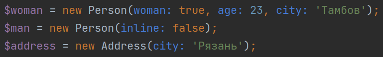

# Fake Person


Вымышленный человек будет сгенерирован со следующими характеристиками: 
фио, пол, день рождения, email, телефон, адрес, паспорт, снилс, инн, профессия, образование

## Usage

Without a framework.
```php
use Reiterus\FakePerson\Person;
use Reiterus\FakePerson\Address;

require 'vendor/autoload.php';

$woman = new Person(woman: true, age: 23, city: 'Тамбов');
$man = new Person(inline: false);
$address = new Address(city: 'Рязань');

print_r([
    'woman_fio' => $woman->getFullName(),
    'man_fio' => $man->getFullName(),
    'array' => $woman->toArray(),
    'json' => $man->toJson(true),
    'address' => $address->__toString(),
]);
```

With the framework like Symfony, for example.
```shell
# config/services.yaml
services:
    _defaults:
        autowire: true
        autoconfigure: true
    # ...
    Reiterus\FakePerson\Fake:
        autowire: true
```

```php
use Reiterus\FakePerson\Fake;

class FakeController extends AbstractController
{
    public function __construct(
        private readonly Fake $fake
    ) {}

    #[Route('/fake/person', name: 'app_fake_person')]
    public function index(): JsonResponse
    {
        return $this->json($this->fake->getPerson(age: 33, city: 'Москва')->toArray());
    }
}
```

## Results
<details>
  <summary>See more...</summary>

```
Array
(
    [woman_fio] => Антипова Полина Дмитриевна
    [man_fio] => Петров Николай Викторович
    [array] => Array
        (
            [full_name] => Антипова Полина Дмитриевна
            [gender] => женщина
            [birthday] => 10.01.2000
            [passport] => 2697 522569
            [address] => 392000, г. Тамбов, ул. Куликово поле, д. 7, кв. 187
            [email] => antipova.polina@rambler.ru
            [phone] => +7 938 293-25-18
            [profession] => продавец
            [education] => высшее
            [inn] => 508541000394
            [pa_number] => 978-862-843 27
        )

    [json] => {
        "full_name": "Петров Николай Викторович",
        "gender": "мужчина",
        "birthday": "21.01.1949",
        "passport": "4025 135257",
        "address": {
            "index": "308000",
            "city": "г. Белгород",
            "street": "ул. Морская",
            "house": "д. 170",
            "apartment": "кв. 43"
        },
        "email": "petrov.nikolay@yandex.ru",
        "phone": "+7 956 034-76-70",
        "profession": "менеджер",
        "education": "среднее профессиональное",
        "inn": "596300052678",
        "pa_number": "041-106-219 83"
    }
    [address] => 390000, г. Рязань, пр-д Арктический, д. 138, кв. 49
)
```
</details>


## Under hood
- объявление свойств в конструкторе
- именованные параметры
- перечисления Enum
- readonly-свойства
